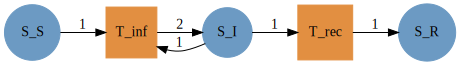
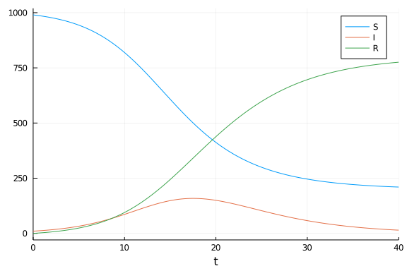
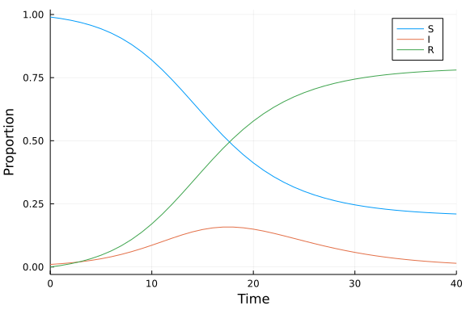
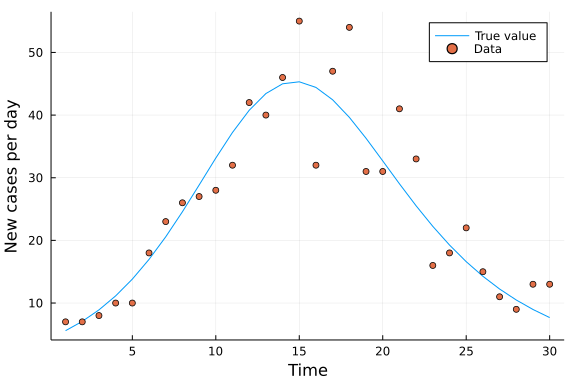
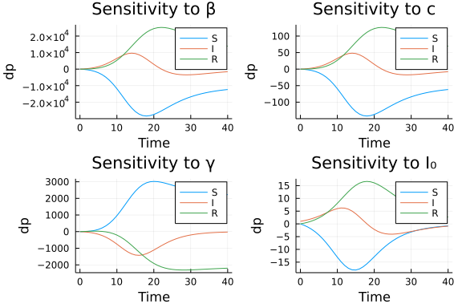
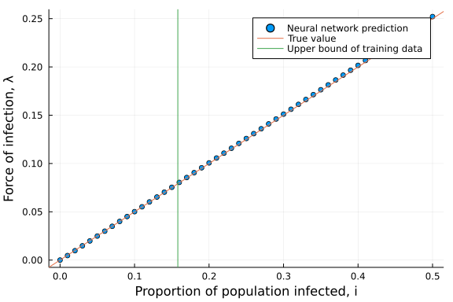
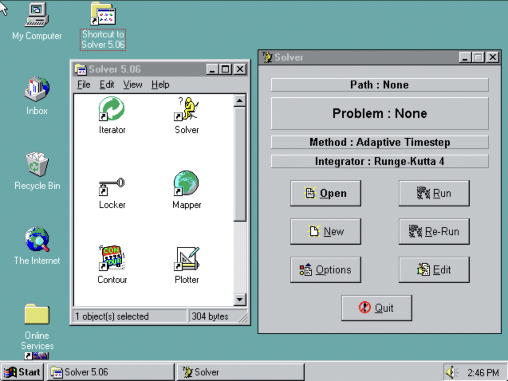
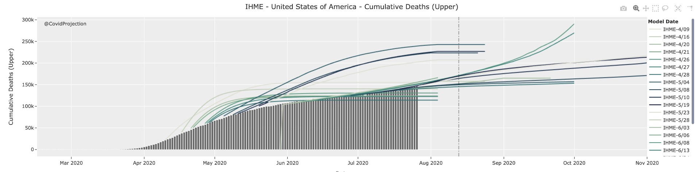
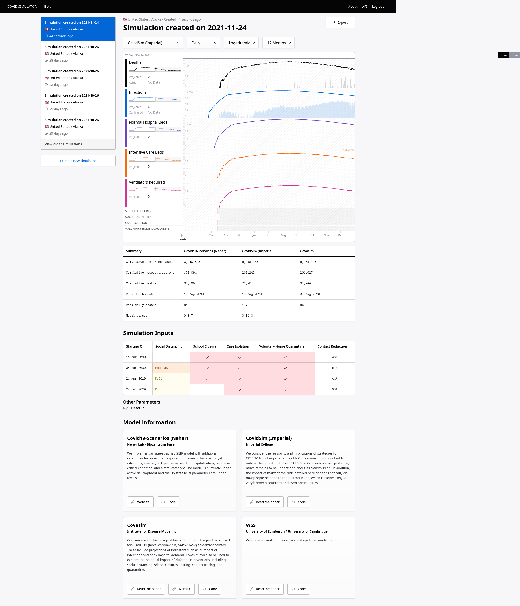
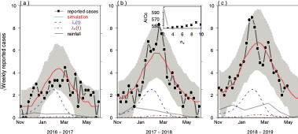

---
title:
output:
  revealjs::revealjs_presentation:
    theme: simple
    css: styles.css
    self_contained: false
    mathjax: local
    reveal_plugins: ["zoom","chalkboard"]
    transition: slide
    background_transition: slide
always_allow_html: yes
---

```{r setup, include=FALSE}
knitr::opts_chunk$set(echo = FALSE)
knitr::opts_chunk$set(fig.align='center')
knitr::opts_chunk$set(fig.width=7)
knitr::opts_chunk$set(fig.height=5)
knitr::opts_chunk$set(out.extra='border:0px;')
```

```{r}
suppressPackageStartupMessages(library(ggplot2))
suppressPackageStartupMessages(library(ggforce))
suppressPackageStartupMessages(library(plotly))
```

```{r}
blank_theme <- theme_minimal()+
  theme(
  axis.title.x = element_blank(),
  axis.title.y = element_blank(),
  panel.border = element_blank(),
  panel.grid=element_blank(),
  axis.ticks = element_blank(),
  plot.title=element_text(size=14, face="bold")
  )
```

<style type="text/css">
code.r{ /* Code block */
    font-size: 28px;
}
code.julia{ /* Code block */
    font-size: 28px;
}
pre { /* Code block - determines code spacing between lines */
    font-size: 32px;
}
</style>

## {data-background=#d3d3d3}

<h2 style="color:#0047AB">Open science approaches to the mathematical modeling of infectious disease</h2>
<br>
<h3 style="color:#000000">Simon Frost</h3>
<h4 style="color:#000000">Principal Data Scientist, Microsoft &</h4>
<h4 style="color:#000000">Professor of Pathogen Dynamics, LSHTM</h4>


<h2>
<span style="font-size:24px"> &nbsp;<a href="mailto:sdwfrost@microsoft.com" target="_blank" style="vertical-align:middle">sdwfrost@microsoft.com</a></span>
<span style="font-size:24px"> &nbsp;<a href="http://www.twitter.com/sdwfrost" target="_blank" style="vertical-align:middle">@sdwfrost</a></span>
<span style="font-size:24px"> &nbsp;<a href="http://github.com/sdwfrost" target="_blank" style="vertical-align:middle">http://github.com/sdwfrost</a></span>
</h2>

## Introduction

- Three parts:
  - Models: making models easier to understand and modify
  - Code: making models easier to run
  - Platforms: empowering models with compute and data
- An open science approach can help with all the above

## Modeling applications

- We want to be able to use our Premonition platform to feed sensor data into models
- We'd also like to learn from models e.g. for decision support
- We're also a small team, and can't make models all the time
- We need to use 'third party' models for our projects
  - West Nile Virus in Harris County, Texas
  - Malaria in Tanzania
  - Lymphatic filariasis in Nepal
  - River blindness in Nigeria
  - Lassa fever in Nigeria
- Complex, climate-sensitive models

## Issues with using models

- They may not consider the compartments you need or the data you have
- They may be difficult to understand
- The written description may be incomplete
- The code, if available, may be difficult to install
- Each model takes different inputs and outputs

## FAIR principles of open science

- **F**indable, **A**ccessible, **I**nteroperable, **R**eproducible
- Models often do not adhere to FAIR principles
- I'll discuss how we might go about changing this
- Associated scientific benefits beyond openness

## Formulating models

- The way we formulate models can make it easier for others to build upon
- A compatible modeling approach
- The ability to comprehend the model
- The ability to extend the model
  - The states considered in the model
  - The method used for inference

## Processes, not states

- Our primary focus in compartmental models is the compartments rather than the transitions
- By modeling the transitions, we can easily shift between ODEs, SDEs, and jump processes
  - Reaction networks in chemistry
  - Petri nets

## Stochastic petri net

$$
\begin{array}{lllll}
	                        \rm{Transition}  & \Delta I & \rm{Rate} \cr \hline
	                S + I \rightarrow I+I &  +1 & \lambda I \cr
	                I \rightarrow R  & -1 & \mu I \cr
	                \end{array}
$$

{width="80%"}

- Transitions: orange squares
- States: blue circles

## ODEs and jump processes

- With the model formulated as transitions, we can easily convert into ODEs, SDEs, and jump processes
- Example can be found [here](https://github.com/epirecipes/sir-julia/blob/master/markdown/pn_petri/pn_petri.md)

<div class="left">

ODE



</div>

<div class="right">

Jump process


</div>

## Moment closure

- Another benefit is to automate moment closure
- Code is [here](https://github.com/epirecipes/sir-julia/blob/master/markdown/momentclosure/momentclosure.md)

{width="80%"}

## Finite state projection of the master equation

- Code is [here](https://github.com/epirecipes/sir-julia/blob/master/markdown/ode_fsp/ode_fsp.md)

{width="80%"}


## Retrofitting models with phylodynamics

- To be able to incorporate phylogenetics into our models, we need to:
  - Take a process based approach
  - Divide processes into:
    - Birth
    - Death
    - Migration
    - Sampling

## Expanding the state space

- Can make non-Markovian models easier to simulate
- Can more closely link models with observables
  - We don't directly observe the contact network or the transmission network

## State expansion in phylodynamic models

- Number of lineages over time
- Clustering statistics
- Tree shape statistics
- Parsimonious counts of migrations in structured models

## Counting infections

- Counting reinfections in SIS models
  - Can account for high reinfection vs. first infection in gonorrhoea
- Counting infectees to capture 'superspreaders'

$$
\begin{align}
	 \frac{dS}{dt} & = -\beta S \Sigma_i I_i\cr
	 \frac{dI_1}{dt} & = \beta S \Sigma_i I_i - \gamma I_1 - \beta S I_1\cr
	 \frac{dI_i}{dt} & = \beta S I_{i-1} - \gamma I_i - \beta S I_i\cr
	 \frac{dI_N}{dt} & = \beta S I_{N-1} - \gamma I_N\cr
\end{align}
$$

## Degree distribution is geometric

- Half of individuals at any one time have not (yet) infected anyone

{width="80%"}

## Dealing with increased complexity

- An argument against increasing the state space is the increased complexity of the models
  - Easier to make mistakes, which may go unnoticed by someone using the model
  - Harder to understand, and hence to re-use
- Possible remedies
  - Use domain specific languages (DSLs)
  - Exploit composability

## Using DSLs

<div class="left">

- R
  - `odin`

```{r,eval=FALSE,echo=TRUE}
deriv(S) <- -beta*S*I
deriv(I) <- beta*S*I - gamma*I
deriv(R) <- gamma*I
initial(S) <- 0.99
initial(I) <- 0.01
initial(R) <- 0.00
beta <- 0.5
gamma <- 0.25
```
</div>

<div class="right">

- Julia
  - `ModelingToolkit.jl`

```{julia,eval=FALSE,echo=TRUE}
@parameters t β γ
@variables S(t) I(t)
D = Differential(t)
eqs = [D(S) ~ -β*S*I,
       D(I) ~ β*S*I-γ*I]
u0 = [S => 990.0, I => 10.0]
p = [β => 0.5, γ => 0.25]
```

</div>

## Linear chain trick

- Code is [here](https://github.com/epirecipes/sir-julia/blob/master/markdown/ode_stages/ode_stages.md)

<large>

```{julia,eval=FALSE,echo=TRUE}
K = 4
@parameters t β δ
@variables S(t) (I(t))[1:K]
D=Differential(t)
ΣI=sum(I[1:K])
eqs=[D(S)    ~ -β*ΣI*S,
     D(I[1]) ~  β*ΣI*S-δ*I[1],
    [D(I[i]) ~  δ*I[i-1]-δ*I[i] for i in 2:K]...]
```

</large>

## An age-structured PDE

```{julia,eval=FALSE,echo=TRUE}
Dt = Differential(t)
Da = Differential(a)
∫a = Integral(a in ClosedInterval(0,A))
[Dt(S(a,t))+Da(S(a,t)) ~ -β*S(a,t)*∫a(I(a,t)),
 Dt(I(a,t))+Da(I(a,t)) ~  β*S(a,t)*∫a(I(a,t))
                         -γ*I(a,t)]
```

## Composability

- Another way to make complex models easier to understand is to compose them from smaller submodels
- Causal approaches: Outputs from one model are linked to inputs of another
  - Volz coalescent models
  - Mick Roberts' ODE/map
- Acausal: Inputs and outputs can be linked between models birectionally
  - Identify shared states between submodels

## An algebraic petri net

 

becomes


- Code is [here](https://github.com/epirecipes/sir-julia/blob/master/markdown/pn_algebraicpetri/pn_algebraicpetri.md)

## Using frameworks with automatic differentiation

- Forward AD: Replace numbers $x$ with dual numbers $x + x' \epsilon$


## Simulated SIR model

<div class="left">



</div>


<div class="right">



</div>


## Local sensitivity

- AD allows us to examine the sensitivity of trajectories to changes in parameters (code [here](https://github.com/epirecipes/sir-julia/blob/master/markdown/ode_local_sensitivity/ode_local_sensitivity.md))



## HMC/No U-Turn Sampler

- We can also use efficient MCMC samplers such as NUTS if we have gradients via AD (code [here](https://github.com/epirecipes/sir-julia/blob/master/markdown/ode_turing/ode_turing.md))


## Neural networks

- Model neural network platforms rely on automatic differentiation
- Neural networks have found their way into the differential equation space and vice versa
  - Using differential equations to create infinitely-deep neural networks
  - Learn the differential operator
  - To build semiparametric models
- 'Learn' the force of infection without making e.g. mass action assumptions


## Learning the force of infection

- Replace $\lambda(t) = \beta I(t)$ with $\lambda(t) = f(I(t))$ where `f` is a neural network. 
- Multiple advantages with replacing state-dependent terms rather than time-dependent terms (code [here](https://github.com/epirecipes/sir-julia/blob/master/markdown/ude/ude.md))




## Using other peoples models

- In many cases, models may be too much work to re-implement
  - We can still compose models using a causal approach
- At the very least, we should be able to reproduce the results of a model if we have the code
- To make models useful, we need to be able to run the models e.g. with different parameter sets

## Making models reproducible

- Papers often omit details of the model, but even if they include all the equations, there can be problems

$$
\begin{align*}
\dfrac{\mathrm dS}{\mathrm dt} &= -\frac{\beta c S I}{N}, \\
\dfrac{\mathrm dI}{\mathrm dt} &= \frac{\beta c S I}{N} - \gamma I,\\ 
\dfrac{\mathrm dR}{\mathrm dt} &= \gamma I, \\
S(t) + I(t) + R(t) &= N \\
S(0) = 990, I(0) = 10, R(0) &= 0 \\
\beta=0.05, c=10, \gamma &= 0.25
\end{align*}
$$

## Why is this not enough for numerical work?

- What numerical precision was used?
- Which solver was used?
- These problems are even more acute with more complex models
  - PDEs: which numerical scheme?
  - Agent based models

## The importance of preservation

{width="80%"}

## The importance of versioning

{width="90%"}

## Packaging the models in 'containers'

- A container is like a lightweight ‘virtual machine’
- You can bundle all the code and dependencies (and even data) that a model needs to run
  - Portable(ish)
  - Reproducible
  - Versioned
  - Makes it easier to run models remotely
- 'Full' packaging can be difficult when commercial packages (Matlab, Mathematica, Maple, etc.) are used

## An example Dockerfile

```
FROM python:3

ARG COVASIM_VER=1.0.0

RUN pip install covasim==${COVASIM_VER} pandas

COPY . /app

CMD ["python", "/app/runsim.py", "/data/input/inputFile.json", "/data/output/data.json"]
```

## Running the models

- JSON (Javascript Object Notation) is an open standard file format, and data interchange format, that uses human-readable text
- Schema can be used to validate
- Goal: Models can be run as:

```my_model input.json output.json```

## An example input

- An array of parameter values, p, an array of initial conditions, u0, and a timespan over which to simulate

```
 {
    "p" : [0.05,10.0,0.25],
    "u0" : [990.0,10.0,0.0],
    "tspan" : [0.0,40.0]
}
```

## A better input

```
 {
    "p" : {"b": 0.05, "c": 10.0, "g": 0.25},
    "u0" : {"S": 990.0, "I": 10.0, "R": 0.0},
    "tspan" : {"tmin", 0.0, "tmax": 40.0, "dt": 0.1}
}
```

## Making application programming interfaces (APIs) to models

- Use default parameters (can use multiple endpoints for different scenarios):
  - `"/run_default"`
- Using a path:
  - `"/run_path/{b}/{g}/{S0}/{I0}/{R0}/{t0}/{tmax}/{dt}"`
- Using JSON formatted data
- Modern tools allow you to add interfaces to your models with as little as 1-2 extra lines of code

## Webpage input

{width="70%"}

- Model runner examples are [here](https://github.com/sdwfrost/model-runner-zoo)

## How do these open science approaches make models more useful?

- Models are often developed in isolation
  - from the data
  - from those who may use the models e.g. in decision making
- Approach
  - Provide a cloud compute platform to run models
  - Provide a data platform to assist epidemiological models
  - Work with stakeholders to build useful dashboards

## Model runner background

- Engineers at GitHub and Microsoft helped to open-source the code for Neil Ferguson's covidsim
- Involved code review by John Cormack (founder Id Software, former CTO of Oculus)
- Refactored the code, containerized it, allowing it to be run in the cloud (Microsoft Azure)
- In parallel, engineers at GitHub developed a model runner and a front-end to run multiple COVID models
  - covidsim, covasim (IDM), covid19-scenarios (Richard Neher), MC19 (Stripe/Harvard)

## Imperial's Covidsim {data-background=#000000}


## Model runner architecture


## Front end



## Issues

- Models didn't have an existing web API, so connectors had to be built
- Models may have little overlap in inputs and/or outputs
- Development shifted to just making a web API to schedule and retrieve model runs

## The Sentinel Project

- Project that brings together modellers in the UK with the Nigerian CDC and ACEGID
- Can we support decisions on Lassa fever surveillance through automated running of models on epidemiological data?
- What is the value of viral sequence information?
- How can we streamline data collection so that it is more accurate and complete?

## Lassa fever in Nigeria

{width="70%"}

## Forecasting Lassa fever in Nigeria

- We've packaged the statistical model from Redding et al. (2021)
- Spatiotemporal model implemented using R-INLA
  - Outcome: number of cases offset by population size
  - Predictors:
    - RW1 on year
    - Cyclic RW2 on week
    - RW2 on SPI (lagged by 120d)
    - RW2 on precipitation (lagged by 60d)
    - Spatial autocorrelation

## Forecasts

{width="90%"}

## Musa et al. (2020) Lassa fever model

{width="80%"}

## Fitted force of infections

{width="90%"}

## Next steps

- What information is useful to the Nigerian CDC?
- How can sensitivity analysis be done interactively?
- How can we extend to other diseases?

## The Computing the Biome project

- Public-private partnership funded by the NSF to study how real-time vector surveillance using Microsoft Premonition devices can empower vector control of West Nile virus in Harris County, Texas
  - Integrate existing data with public datasets
  - Generate sequence data from mosquito samples
  - Add real time mosquito data and weather data
  - Build models
  - Feed results back to interested parties

## Where to put our devices?

- Treating our traps as a limited resource, where should we place our devices?
- Developing adaptive sampling protocols in order to guide the logistics of moving traps around
- Very outcome-dependent
- For Harris County, we have historical data going back to 2006 on weekly trapping counts and West Nile Virus results on pooled mosquitoes
  - Provide short term forecasts using data-driven models
  - Long term scenarios/projections using mechanistic models

## Spatial patterns in Harris County

{width="90%"}

## An exemplar data ecosystem

- As part of the Computing the Biome project, we will provide a snapshot of our data lake
  - Mosquito and vector control data (from Harris County Public Health)
  - High-resolution climate data (from Tomorrow.io)
  - Data from our biological weather stations (from MSFT)
  - Integrated with other public datasets
    - Human population data
    - Social vulnerability data
    - Land use data
    - LIDAR data

## Models

- We're working with David Smith and Sean Wu (UW IHME) to integrate their models into our architecture 
- MicroMoB
  - Discrete time, deterministic or stochastic model for mosquito density and vector-borne disease
- exDE
  - Continuous time, differential equation based framework for mosquito density and vector-borne disease
- MBITES
  - Individual-based model for patterns of daily activity

## exDE framework

{width="80%"}

## Linking vector control and weather to mosquito models

{width="50%"}

## Finding models

- I've spoken about Accessibility, Interoperability, and Reproducibility
  - What about Findability?
- Implementations that are hard to find
  - Age of infection models
  - Age structured models
  - Size structured models
  
## Epirecipes

- Started when I was a Turing Fellow at The Alan Turing Institute
- Aims:
  - Code as many models and techniques in as many computer languages as possible
  - Provide a zero-install way to try out these models
- Current development
  - Illustrate as many techniques applied to a simple SIR type system
  - Coded primarily in Julia

## Demos include...

- Different frameworks:
  - ODEs, DDEs, SDEs, jump processes, maps, Markov models, agent based models, discrete event simulations
- Inference (mostly for ODEs)
  - MCMC, nested sampling, ML through optimization, ABC
- Composition
- Surrogate models
- Uncertainty quantification
- Miscellaneous
  - Adomian polynomials, fractional differential equations

## Things that help promote model re-use

- Think about modeling in terms of processes rather than states
- Simplify the model description using domain specific languages
- Make the model composable so the model building process is evident
- Provide parameter ranges and default scenarios
- Package the model with self-documenting inputs and outputs

## Conclusions

- I've tried to promote an open science approach to numerical methods in epidemiological modeling
- Potential benefits
  - Citations! Fame!
  - Others can verify and build on your work
  - Development of data and compute platforms that may help your models
- Modern computational tools lessen the burden of adopting these practices
- Let me know if you want a reference implementation of your approach

## Links

- Microsoft Premonition
  - [https://microsoft.com/premonition](https://microsoft.com/premonition)
- Epirecipes
  - [http://epirecip.es](http://epirecip.es) (old site)
  - [http://github.com/epirecipes/sir-julia](http://github.com/epirecipes/sir-julia)
- APIs/COVID Model Runner
  - [https://covid-policy-modelling.github.io/](https://covid-policy-modelling.github.io/)
  - [https://github.com/sdwfrost/model-runner-zoo](https://github.com/sdwfrost/model-runner-zoo)
- Mosquito modeling
  - exDE: [https://github.com/dd-harp/exde](https://github.com/dd-harp/exde)
  - MicroMoB: [https://github.com/dd-harp/MicroMoB](https://github.com/dd-harp/MicroMoB)
  - MBITES: [https://github.com/dd-harp/MBITES](https://github.com/dd-harp/MBITES)

## Thanks!

<h2>
<span style="font-size:24px"> &nbsp;<a href="mailto:sdwfrost@microsoft.com" target="_blank" style="vertical-align:middle">sdwfrost@microsoft.com</a></span>
<span style="font-size:24px"> &nbsp;<a href="http://www.twitter.com/sdwfrost" target="_blank" style="vertical-align:middle">@sdwfrost</a></span>
<span style="font-size:24px"> &nbsp;<a href="http://github.com/sdwfrost" target="_blank" style="vertical-align:middle">http://github.com/sdwfrost</a></span>
</h2>


